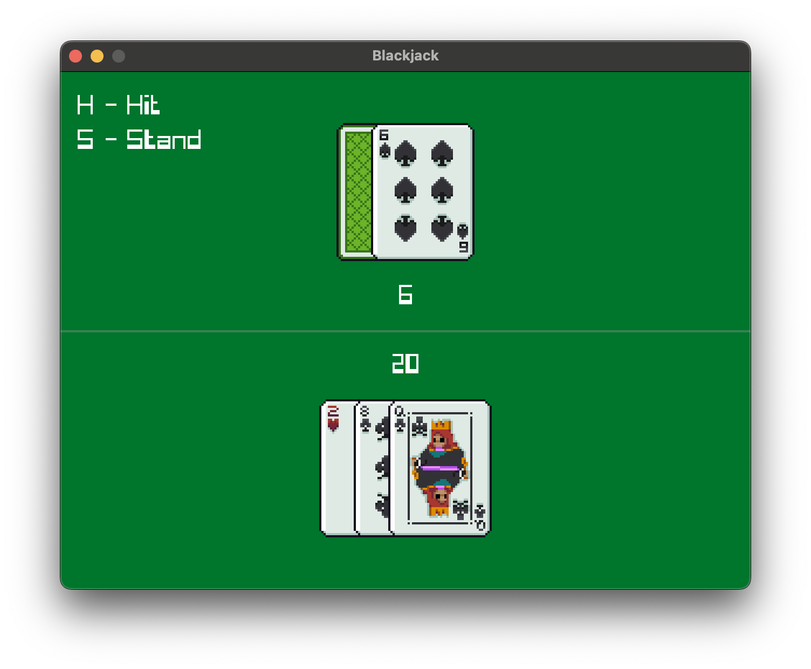

# Blackjack

A simple game of Blackjack made using Odin and Raylib.

## Running

odin run src -out:bin/blackjack

## Controls

| Key | Action |
|-----|--------|
| **H** | Hit |
| **S** | Stand |
| **R** | Restart |
| **Esc** | Quit |

## Thanks

- [Card sprites by IvoryRed](https://ivoryred.itch.io/pixel-poker-cards) (CC BY 4.0)
